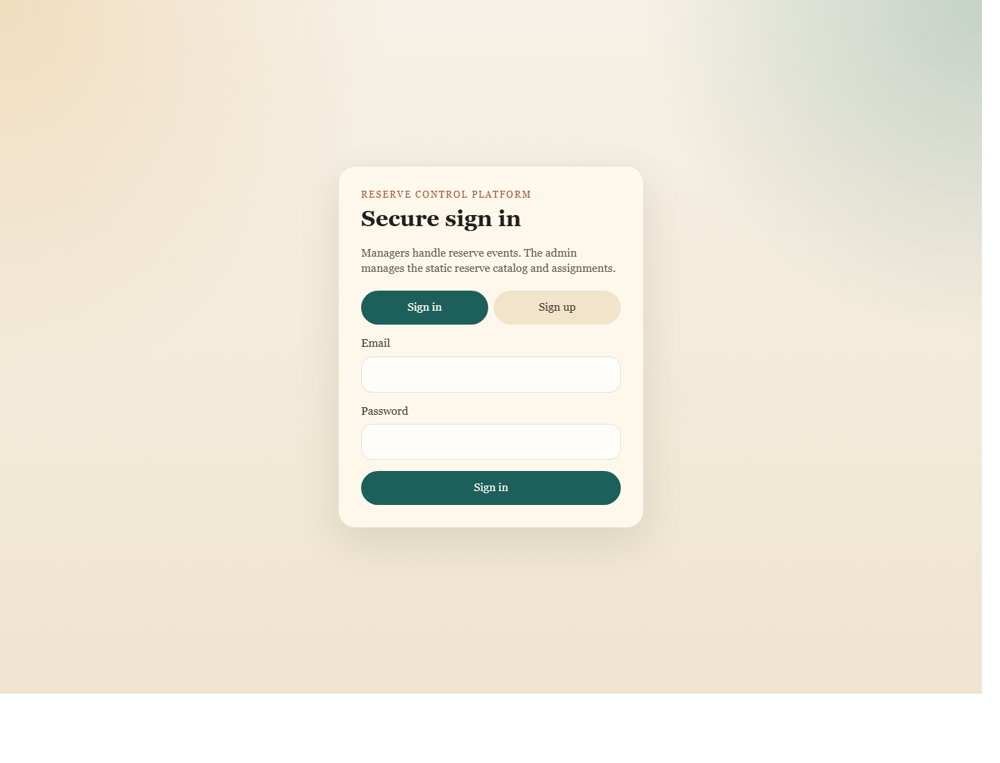

# Reserve Management System

A full-stack academic software project for monitoring protected nature reserves, coordinating operational events, and sharing approved public updates with travelers. The system combines a Spring Boot backend, a React web dashboard for administrators and reserve managers, and an Android app for travelers who want to follow live reserve updates or submit reports from the field.

## Highlights

- Role-based authentication for administrators and reserve managers
- Reserve catalog seeded from structured reserve metadata
- Manager workflow for creating, prioritizing, publishing, and closing reserve events
- Admin workflow for reviewing reserve requests and assigning managers
- Public traveler API for published updates and traveler incident reports with media attachments
- Dockerized PostgreSQL database and Flyway schema migrations
- React dashboard with map-based reserve views
- Android client connected to the public traveler endpoints

## Architecture

- `backend`: Java 17, Spring Boot, Spring Security, Flyway, PostgreSQL
- `web-app`: React, Vite, Axios, Leaflet
- `mobile-app`: Android (Java), Gradle, Android Studio
- `uploads/traveler-media`: local storage for traveler report attachments at runtime

## Screenshots

### Web dashboard



### Android traveler app


## Demo Accounts

Seeded administrator account:

- Email: `admin@reserve.local`
- Password: `ChangeMe123!`

Managers can create their own accounts from the web sign-up screen.

## Local Setup

### 1. Start the database

```bash
cd backend
docker compose up -d
```

This starts PostgreSQL on `localhost:5432` with the default credentials already configured in the backend.

### 2. Run the backend

```bash
cd backend
./mvnw spring-boot:run
```

Windows shortcut from the repo root to start the database, backend, and web app together:

```powershell
.\run-backend.cmd
```

The script opens the backend and web app in separate terminal windows.

Backend base URL: `http://localhost:8080`
Web app URL: `http://localhost:5173`

Useful endpoints:

- `POST /api/auth/login`
- `GET /api/auth/me`
- `GET /api/admin/reserves`
- `GET /api/public/reserves`
- `GET /api/public/events?reserveId=<id>`
- `POST /api/public/reports`

### 3. Run the web dashboard

```bash
cd web-app
npm install
npm run dev
```

Web app URL: `http://localhost:5173`

Optional environment variable:

```bash
VITE_API_BASE_URL=http://localhost:8080
```

### 4. Run the Android app

1. Open `mobile-app` in Android Studio.
2. Start an emulator such as `Pixel_7`.
3. Run the `app` configuration.

The Android app is configured to reach the local backend through `http://10.0.2.2:8080`.

## Repository Structure

```text
backend/
  src/main/java/...            Spring Boot API, security, and domain logic
  src/main/resources/db/...    Flyway migrations and reserve seed data
mobile-app/
  app/src/main/java/...        Android client
  app/src/main/res/...         Layouts and resources
web-app/
  src/App.jsx                  Admin dashboard entry point
  src/manager/...              Manager workspace UI
```

## What This Project Demonstrates

- Backend API design and layered service architecture
- Authentication and authorization with JWT
- Relational schema design and incremental database migrations
- Full-stack integration between backend, web, and mobile clients
- Docker-based local development workflow
- UI development for both browser and Android environments

## Notes

- Traveler media uploads are stored locally during development and are ignored by git.
