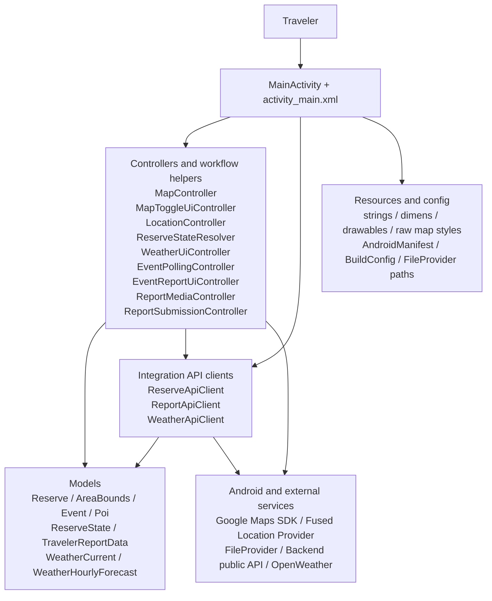
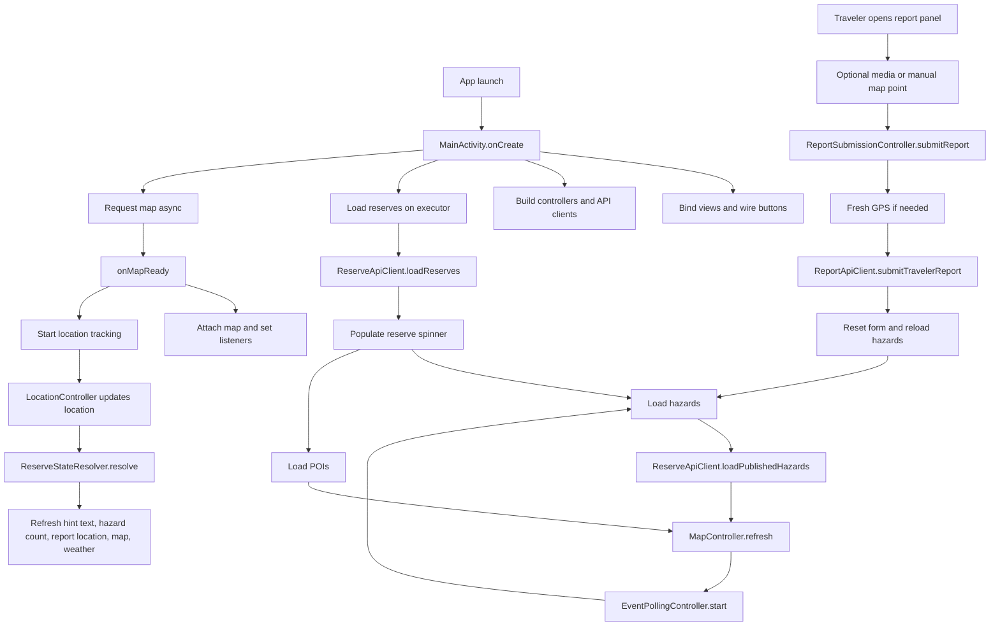

# Android App Block Diagram

This document shows the mobile app architecture at two levels:

- a high-level structural block diagram
- a workflow diagram that follows the main runtime path

Draw.io source:

- [traveler_app_block_diagram.drawio](./traveler_app_block_diagram.drawio)

Related docs:

- [Mobile App Architecture and Planning Document](./mobile-app-planning.md)
- [Mobile App Programmer Guide](./mobile-app-programmer-guide.md)
- [MainActivity Workflow](./main-activity-workflow.md)

## High-Level Block Diagram

## How To Read The High-Level Diagram

- `MainActivity + activity_main.xml` is the visible screen and the main coordination point.
- Controllers sit one step below the activity and own feature-specific logic.
- API clients sit at the integration boundary and fetch or send data.
- Models are the data that flows between API clients, controllers, and the activity.
- Resources and config define how the app looks and what endpoints and keys it uses.
- Android and external services sit outside the app and are called through the controllers or API clients.

## Runtime Workflow In Text

The normal runtime path is:

1. Android launches `MainActivity`.
2. `MainActivity` binds the layout, builds controllers and API clients, and starts reserve loading.
3. The map fragment returns a `GoogleMap` through `onMapReady(...)`.
4. `LocationController` begins GPS tracking.
5. `ReserveApiClient` loads reserves, hazards, and POIs.
6. `ReserveStateResolver` computes whether the traveler is inside a reserve.
7. `MapController` renders reserve polygons, hazards, and optional POIs.
8. `WeatherUiController` optionally loads weather if the traveler enables it.
9. `ReportMediaController`, `EventReportUiController`, `ReportSubmissionController`, and `ReportApiClient` support report creation and upload.
10. `EventPollingController` keeps hazard data refreshed in the background.

## Workflow Diagram

## Workflow Notes

- Reserve loading and map readiness happen independently and meet later at UI refresh time.
- Location updates are important because they drive:
  - reserve state
  - report location label
  - optional weather refresh
  - camera recenter behavior
- Hazard polling loops back into the hazard-load path every 15 seconds.
- Report submission loops back into hazard loading so new traveler-origin events can appear after submission.

## Why The Draw.io File Matters

The Mermaid diagrams in this document are easy to read in markdown. The Draw.io file is better when you want to:

- open and edit the diagram visually
- export PNG or PDF versions
- rearrange architecture blocks for a presentation
- add team-specific annotations later
