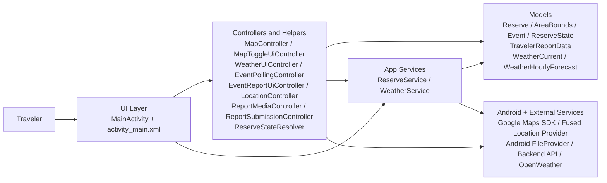

# Android App Block Diagram

This diagram complements the mobile app planning document and shows the main structural blocks of the Android app and how data moves between them.

Related document: [Mobile App Planning Document](./mobile-app-planning.md)

## How To Draw It Yourself

Use this sequence:

1. Start with the app entry point in the center: `MainActivity`.
2. Group the code around it into 4 boxes:
   - UI layer
   - controllers/helpers
   - app services
   - Android and external services
3. Add model classes as a separate shared data box.
4. Draw arrows only for major dependencies or data flow.
5. Ignore method-level details. Keep only the blocks that explain architecture.

For this app, the easiest mental model is:

- `MainActivity` coordinates everything.
- helpers handle focused screen behavior or workflow logic.
- app services fetch or send data.
- models carry data.
- Android services and external APIs sit outside the app core.

## High-Level View

This is the version to use when you want to explain the system quickly in class, in a presentation, or at the start of a design document.

## Class Relations View

This version is closer to the code. It focuses on the classes in `com.reserve.mobile` and shows ownership, usage, and data-model relations.

```mermaid
classDiagram
    class MainActivity
    class MapController
    class MapToggleUiController
    class WeatherUiController
    class EventPollingController
    class EventReportUiController
    class LocationController
    class ReportMediaController
    class ReportSubmissionController
    class ReserveStateResolver
    class ReserveService
    class WeatherService
    class Reserve
    class AreaBounds
    class Event
    class ReserveState
    class TravelerReportData
    class WeatherCurrent
    class WeatherHourlyForecast

    MainActivity --> MapController : creates / calls
    MainActivity --> MapToggleUiController : creates / calls
    MainActivity --> WeatherUiController : creates / calls
    MainActivity --> EventPollingController : creates / starts
    MainActivity --> EventReportUiController : creates / calls
    MainActivity --> LocationController : creates / calls
    MainActivity --> ReportMediaController : creates / calls
    MainActivity --> ReportSubmissionController : creates / calls
    MainActivity --> ReserveStateResolver : uses
    MainActivity --> ReserveService : uses
    MainActivity --> WeatherService : owns instance
    MainActivity o-- Reserve : holds list
    MainActivity o-- Event : holds list
    MainActivity o-- ReserveState : stores current state

    WeatherUiController --> WeatherService : uses
    WeatherUiController o-- WeatherCurrent : caches
    WeatherUiController o-- WeatherHourlyForecast : caches list

    MapToggleUiController --> MapController : reads toggle state

    MapController --> Reserve : renders
    MapController --> Event : renders
    Reserve *-- AreaBounds : contains
    MapController --> AreaBounds : reads bounds

    EventPollingController ..> MainActivity : triggers hazard reload callback
    EventReportUiController ..> MainActivity : invoked by
    LocationController ..> MainActivity : host callbacks
    ReportMediaController ..> MainActivity : activity-result flow
    ReportSubmissionController --> ReserveService : uploads through
    ReportSubmissionController ..> TravelerReportData : creates
    ReserveStateResolver --> Reserve : reads
    ReserveStateResolver --> Event : reads
    ReserveStateResolver ..> ReserveState : builds

    ReserveService ..> Reserve : creates
    ReserveService ..> AreaBounds : creates
    ReserveService ..> Event : creates
    ReserveService --> TravelerReportData : uploads

    WeatherService ..> WeatherCurrent : creates
    WeatherService ..> WeatherHourlyForecast : creates
```

How to read it:

- `-->` means a class directly uses or calls another class.
- `..>` means a weaker dependency, such as callback flow or object creation.
- `o--` means a class holds references to instances of another class.
- `*--` means strong containment, like `Reserve` owning its `AreaBounds`.

## Component View

```mermaid
flowchart TB
    User[Traveler]

    subgraph UI[Android App UI Layer]
        Layout[activity_main.xml]
        MainActivity[MainActivity]
    end

    subgraph Helpers[Controllers and Helpers]
        MapController[MapController]
        ToggleController[MapToggleUiController]
        WeatherController[WeatherUiController]
        PollingController[EventPollingController]
        ReportUiController[EventReportUiController]
        LocationController[LocationController]
        MediaController[ReportMediaController]
        SubmissionController[ReportSubmissionController]
        StateResolver[ReserveStateResolver]
    end

    subgraph AppServices[App Services]
        ReserveServiceNode[ReserveService]
        WeatherServiceNode[WeatherService]
    end

    subgraph Models[Models]
        ReserveModel[Reserve + AreaBounds]
        EventModel[Event]
        StateModel[ReserveState]
        ReportModel[TravelerReportData]
        WeatherModel[WeatherCurrent + WeatherHourlyForecast]
    end

    subgraph External[Android and External Services]
        GoogleMap[Google Maps SDK]
        LocationProvider[Fused Location Provider]
        FileProvider[Android FileProvider]
        Backend[Backend API]
        OpenWeather[OpenWeather API]
    end

    User --> MainActivity
    Layout --> MainActivity

    MainActivity --> MapController
    MainActivity --> ToggleController
    MainActivity --> WeatherController
    MainActivity --> PollingController
    MainActivity --> ReportUiController
    MainActivity --> LocationController
    MainActivity --> MediaController
    MainActivity --> SubmissionController
    MainActivity --> StateResolver
    MainActivity --> ReserveServiceNode

    PollingController --> MainActivity

    MapController --> GoogleMap
    ReportUiController --> GoogleMap
    LocationController --> LocationProvider
    MediaController --> FileProvider
    WeatherController --> WeatherServiceNode
    SubmissionController --> LocationProvider
    SubmissionController --> ReserveServiceNode

    StateResolver --> ReserveModel
    StateResolver --> EventModel
    StateResolver --> StateModel

    ReserveServiceNode --> Backend
    WeatherServiceNode --> OpenWeather

    ReserveServiceNode --> ReserveModel
    ReserveServiceNode --> EventModel
    ReserveServiceNode --> ReportModel
    WeatherServiceNode --> WeatherModel

    MapController --> ReserveModel
    MapController --> EventModel
    WeatherController --> WeatherModel
    MainActivity --> StateModel
```

## Reading The Diagram

- `MainActivity` is the app's central orchestrator and the main owner of screen state.
- `MapController`, `WeatherUiController`, `EventPollingController`, `EventReportUiController`, `LocationController`, `ReportMediaController`, `ReportSubmissionController`, and `ReserveStateResolver` keep focused workflows out of the activity.
- `ReserveService` and `WeatherService` are the integration boundary to backend and weather APIs.
- `Reserve`, `AreaBounds`, `Event`, `ReserveState`, `TravelerReportData`, and weather models are the data objects passed between services, helpers, and the activity.
- Google Maps, device location, file handling, the backend API, and OpenWeather sit outside the app core and are used through the helpers or services.

## Primary Data Paths

### Map and reserve flow

`MainActivity` -> `ReserveService` -> `Backend API` -> `Reserve` / `Event` -> `MapController` -> `Google Maps SDK`

### Location and reserve detection flow

`Fused Location Provider` -> `LocationController` -> `MainActivity` -> `ReserveStateResolver` -> `ReserveState` -> location hint + hazard count + map refresh + report location text

### Weather flow

`MainActivity` -> `WeatherUiController` -> `WeatherService` -> `OpenWeather API` -> weather models -> weather overlay

### Traveler report flow

User input + media -> `ReportMediaController` / `EventReportUiController` -> `MainActivity` -> `ReportSubmissionController` -> `TravelerReportData` -> `ReserveService` -> `Backend API`
