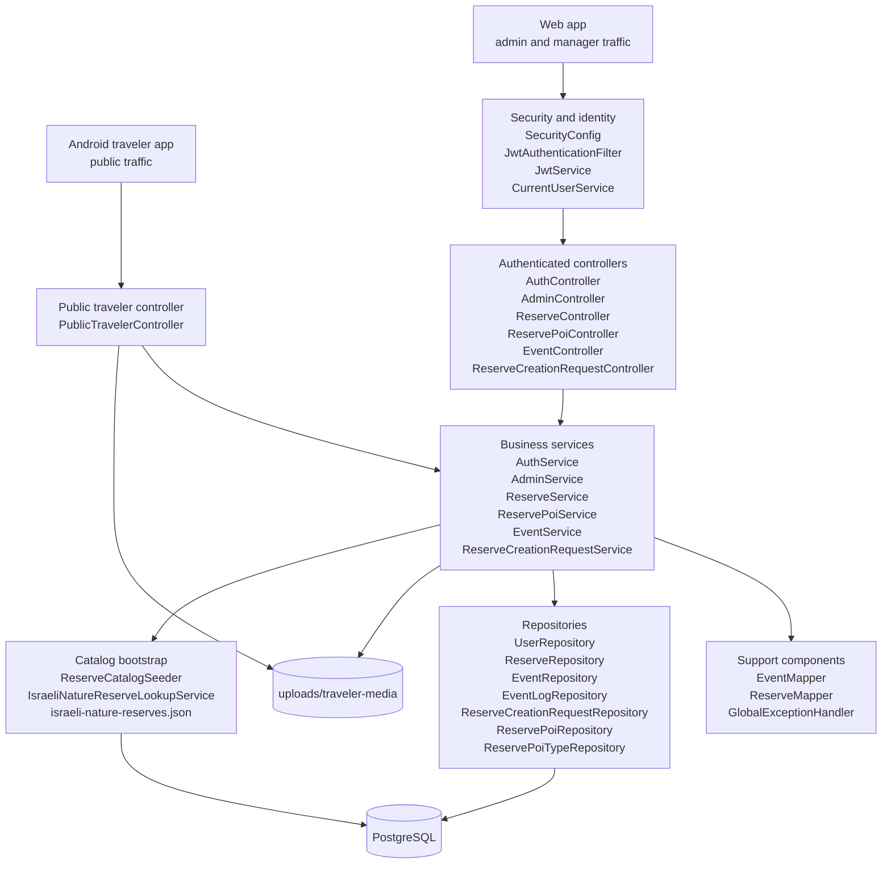

# Backend Block Diagram

This document explains the current Spring Boot backend structure at a component level.

Draw.io source:

- [backend_block_diagram.drawio](./backend_block_diagram.drawio)

Related docs:

- [Backend README](../backend/README.md)
- [Database Block Diagram](./database-block-diagram.md)
- [System Architecture Planning Document](./system-architecture-planning.md)

## Backend Block Diagram

## How To Read The Diagram

- Authenticated staff traffic from the web app passes through the JWT security boundary before it reaches the protected controllers.
- Public traveler traffic enters through `PublicTravelerController`, which exposes read-only reserve data plus traveler report and media endpoints.
- Controllers stay thin and delegate nearly all business rules to the service layer.
- Services handle reserve access checks, role checks, coordinate validation, event lifecycle changes, POI management, and reserve request workflows.
- Repositories are the persistence boundary for PostgreSQL.
- Traveler attachments are stored outside the database in `uploads/traveler-media`.
- Reserve catalog seeding is a startup concern fed by `israeli-nature-reserves.json`.

## Main Request Paths

### Staff Authenticated Flow

1. The web app sends a login request or a bearer token.
2. `JwtAuthenticationFilter` resolves the token into a `UserPrincipal`.
3. Controllers call services.
4. Services use `CurrentUserService` plus repositories to enforce admin and manager access rules.
5. DTO mappers shape the response back to the web app.

### Traveler Public Flow

1. The Android app calls `/api/public/reserves`, `/api/public/events`, `/api/public/reserves/{id}/pois`, or `/api/public/reports`.
2. `PublicTravelerController` delegates into the same reserve, POI, and event services used elsewhere.
3. Traveler report attachments are saved to local media storage and linked through `event_media`.
4. The resulting event becomes visible to managers in the web dashboard.

## Notes

- Security is mostly endpoint-level plus service-level. Public routes are explicitly opened in `SecurityConfig`.
- `EventService` and `ReservePoiService` both validate that coordinates stay inside the selected reserve boundary.
- `GlobalExceptionHandler` keeps error responses consistent across controllers.
