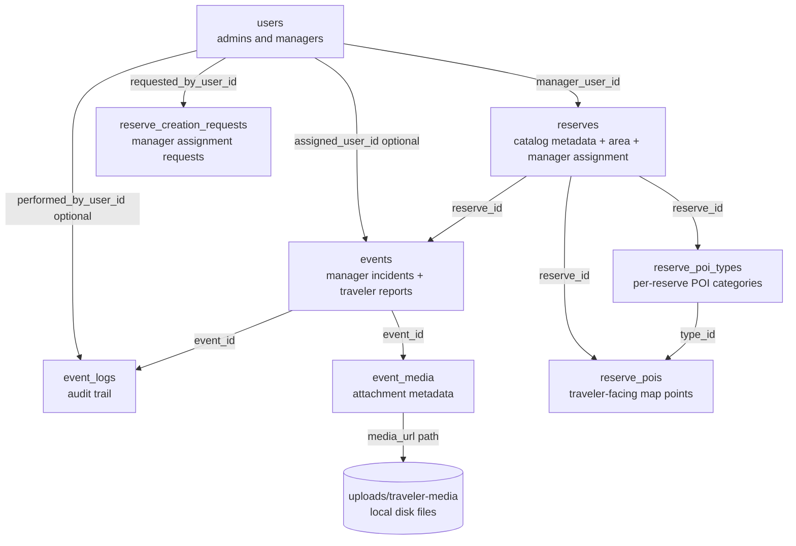

# Database Block Diagram

This document summarizes the backend persistence model at a table and relationship level.

Draw.io source:

- [database_block_diagram.drawio](./database_block_diagram.drawio)

Related docs:

- [Backend README](../backend/README.md)
- [Backend Block Diagram](./backend-block-diagram.md)
- [System Architecture Planning Document](./system-architecture-planning.md)

## Database Block Diagram

## How To Read The Diagram

- `users` holds both administrators and reserve managers.
- `reserves` is the main catalog table and includes area bounds, display metadata, polygon GeoJSON, and the current manager assignment.
- `events` is the operational core. Manager-created incidents and traveler reports end up in the same table.
- `event_logs` keeps the audit trail for creation, status, priority, and publish changes.
- `event_media` stores attachment metadata, while the actual files live outside PostgreSQL in `uploads/traveler-media`.
- `reserve_creation_requests` supports the manager-to-admin assignment workflow.
- `reserve_poi_types` and `reserve_pois` support traveler-facing map points for each active reserve.

## Main Relationship Groups

### Identity And Assignment

- One user can manage many reserves.
- One user can submit many reserve creation requests.
- An event can optionally be assigned to a user.
- An event log can optionally record which user performed the action.

### Reserve Operations

- One reserve can have many events.
- One reserve can define many POI types.
- One reserve can contain many POIs.

### Event Audit And Media

- One event can have many log entries.
- One event can have many media rows.
- Each media row points to a file served by the backend from local disk storage.

## Notes

- The schema evolves through Flyway migrations in `backend/src/main/resources/db/migration`.
- Bounding boxes live directly in `reserves` through the embedded `Area` fields rather than a separate geometry table.
- Polygon GeoJSON is stored on `reserves`, which keeps reserve geometry close to the catalog record.
