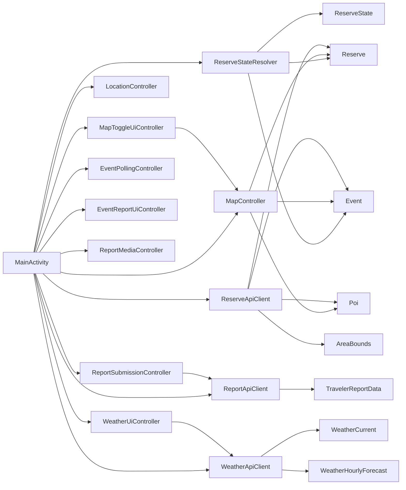

# Mobile App Architecture and Planning Document

This document is a code-accurate planning and architecture reference for the Android `mobile-app` module only.

Companion docs:

- [Mobile App Programmer Guide](./mobile-app-programmer-guide.md)
- [Android App Block Diagram](./android-app-block-diagram.md)
- [MainActivity Workflow](./main-activity-workflow.md)
- [Draw.io source](./traveler_app_block_diagram.drawio)

## Scope

The mobile app is a traveler-facing Android client. It does four main things:

- shows reserve boundaries on a Google Map
- shows traveler-visible hazards and public POIs
- detects whether the traveler is inside a reserve
- lets the traveler submit field reports with optional media attachments

The app is intentionally traveler-only. It does not expose admin or manager workflows.

## Build And Runtime Shape

### Module layout

- `mobile-app/settings.gradle`
  Declares `:app` as the Android application module and configures repositories.
- `mobile-app/build.gradle`
  Declares the Android Gradle plugin version for the module.
- `mobile-app/app/build.gradle`
  Defines the Android application, SDK versions, Java 17 compatibility, dependencies, and generated `BuildConfig` values.
- `mobile-app/gradle.properties.example`
  Local configuration template for API keys, backend base URL, and AndroidX support.
- `mobile-app/gradle.properties`
  Local, developer-specific overrides used at build time. This file should stay ignored by git.
- `mobile-app/README.md`
  Module-level quick start and doc index.

### Generated build-time values

`app/build.gradle` generates these `BuildConfig` values:

- `BACKEND_API_BASE`
  Public backend API base, defaulting to `http://10.0.2.2:8080/api/public`
- `OPEN_WEATHER_API_BASE`
  Weather API base, defaulting to OpenWeather current-weather endpoint
- `OPEN_WEATHER_API_KEY`
  Weather API key

### Android manifest setup

`mobile-app/app/src/main/AndroidManifest.xml` defines:

- internet permission
- coarse and fine location permissions
- Google Maps API key placeholder
- `FileProvider` for camera-created report photos
- `MainActivity` as the launcher activity

### Dependency summary

The app uses:

- `androidx.appcompat`
- `com.google.android.material`
- Google Maps SDK
- Google Play Services location APIs

### Runtime shape

This is a single-activity app.

- `MainActivity` owns the screen lifecycle and most runtime state.
- Focused helper classes keep feature-specific logic out of the activity.
- Three API client classes perform network I/O and upload work.
- Small model classes carry data between layers.

## Responsibility Layers

These are not formal Gradle modules or hard architectural boundaries. They are responsibility layers that persist in the current code and are useful when planning changes.

### 1. Presentation layer

- `MainActivity`
- `activity_main.xml`
- `strings.xml`
- dimension resources
- drawable resources

This layer owns visible UI, user input, and the final rendering of state.

### 2. Workflow and screen-logic layer

- `MapController`
- `MapToggleUiController`
- `LocationController`
- `ReserveStateResolver`
- `WeatherUiController`
- `EventPollingController`
- `EventReportUiController`
- `ReportMediaController`
- `ReportSubmissionController`

This layer contains logic that is more specific than a plain data model but more focused than the whole activity.

### 3. Integration layer

- `ReserveApiClient`
- `ReportApiClient`
- `WeatherApiClient`

This layer talks to backend or weather APIs and maps raw responses into app models.

### 4. Model layer

- `Reserve`
- `AreaBounds`
- `Event`
- `Poi`
- `ReserveState`
- `TravelerReportData`
- `WeatherCurrent`
- `WeatherHourlyForecast`

This layer holds data and exposes simple helper methods.

### 5. Platform and external dependencies

- Google Maps SDK
- Fused Location Provider
- Android `FileProvider`
- backend public API
- OpenWeather API

## Class Roles And Relations

### Core orchestrator

- `MainActivity`
  The composition root and runtime coordinator. It creates controllers and API clients, binds the layout, owns the current reserve/location/hazard lists, and decides when UI refreshes happen.

### UI and workflow helpers

- `MapController`
  Owns map rendering, map style switching, reserve polygons, hazard markers, and POI marker icons.
- `MapToggleUiController`
  Updates button labels, tints, and weather button visual state.
- `LocationController`
  Handles permission-result flow, last known location lookup, and continuous live location updates.
- `ReserveStateResolver`
  Translates raw location plus loaded reserve/hazard data into a `ReserveState`.
- `WeatherUiController`
  Owns weather overlay state, weather caching decisions, and weather text rendering.
- `EventPollingController`
  Repeats hazard refresh on a timer.
- `EventReportUiController`
  Owns report-panel visibility and manual report-location marker state.
- `ReportMediaController`
  Owns media picker and camera attachment state.
- `ReportSubmissionController`
  Validates report input, gets a fresh GPS fix when needed, builds `TravelerReportData`, and uploads through `ReportApiClient`.

### API clients

- `ReserveApiClient`
  Loads reserves, hazards, and POIs from the public backend.
- `ReportApiClient`
  Uploads traveler reports as multipart form data.
- `WeatherApiClient`
  Loads current weather and hourly forecast from OpenWeather.

### Models

- `Reserve`
  One public reserve record, including rectangular area bounds.
- `AreaBounds`
  Simple min/max latitude-longitude rectangle.
- `Event`
  One traveler-visible hazard record.
- `Poi`
  One public point-of-interest record.
- `ReserveState`
  Screen-facing state for no location, inside reserve, or outside reserve.
- `TravelerReportData`
  Report payload assembled before upload.
- `WeatherCurrent`
  Current weather snapshot.
- `WeatherHourlyForecast`
  One hourly forecast line.

### High-level dependency map

## End-To-End Workflows

### Startup and first render

1. Android launches `MainActivity`.
2. `onCreate()` builds controllers and API clients, binds views, registers activity-result launchers, wires click listeners, and asks the map fragment for `getMapAsync(...)`.
3. `loadReserves()` starts immediately on the background executor.
4. `onMapReady(...)` stores the `GoogleMap`, disables unused built-in controls, wires manual map tap handling, attaches the map controller, and starts location tracking.
5. When reserve data arrives, the spinner, map, and reserve-state UI update.
6. When hazards arrive, the map and hazard count update and polling starts.

### Location and reserve resolution

1. `LocationController.startTracking(...)` checks permission or requests it.
2. The controller asks for last known location, then subscribes to live updates.
3. `MainActivity.applyCurrentLocation(...)` stores the latest location and optionally recenters the map.
4. `updateReserveState()` uses `ReserveStateResolver` to compute whether the user is inside a reserve.
5. The activity refreshes:
   - reserve hint text
   - hazard count text
   - selected reserve spinner item
   - report location label
   - map content
   - weather overlay state

### Weather flow

1. Traveler taps the weather toggle.
2. `MainActivity` toggles `showWeather` and calls `refreshWeather(...)`.
3. `WeatherUiController` decides whether the cache is still valid.
4. If needed, it uses `WeatherApiClient` to fetch current and hourly weather.
5. It renders compact text and optional hourly detail.

### Traveler report flow

1. Traveler opens the report panel.
2. Traveler chooses a reserve, report type, description, and optional name.
3. Traveler can:
   - add media from storage
   - capture a photo
   - use current GPS
   - tap the map to set a manual report point
4. `ReportSubmissionController.submitReport(...)` validates input.
5. If manual map point exists, it is used directly.
6. Otherwise the controller asks for a fresh high-accuracy location.
7. `TravelerReportData` is assembled and uploaded through `ReportApiClient.submitTravelerReport(...)`.
8. On success, the report form resets and hazards reload.

## File-By-File Catalog

### Build, config, and entry files

- `mobile-app/README.md`
  Human-readable module overview and run instructions.
- `mobile-app/settings.gradle`
  Includes the app module and Gradle repositories.
- `mobile-app/build.gradle`
  Top-level Android plugin declaration.
- `mobile-app/app/build.gradle`
  App plugin, SDK versions, Java version, dependencies, and generated config values.
- `mobile-app/gradle.properties.example`
  Copyable template for local keys and URLs.
- `mobile-app/gradle.properties`
  Local developer config used by Gradle.
- `mobile-app/app/src/main/AndroidManifest.xml`
  Permissions, launcher activity, Maps API key, and `FileProvider`.

### Java source files

- `MainActivity.java`
  Main screen coordinator and state owner.
- `MapController.java`
  Google Map rendering logic and POI icon selection.
- `MapToggleUiController.java`
  Drawer and weather-toggle visual state.
- `LocationController.java`
  Permission flow and live GPS tracking.
- `ReserveStateResolver.java`
  Pure-ish reserve-state calculation.
- `WeatherUiController.java`
  Weather overlay state and cached refresh rules.
- `WeatherApiClient.java`
  OpenWeather HTTP and JSON parsing.
- `ReportApiClient.java`
  Multipart report upload client.
- `EventPollingController.java`
  Repeating hazard refresh timer.
- `EventReportUiController.java`
  Report panel visibility and manual map-location state.
- `ReportMediaController.java`
  Media picker and camera attachment workflow.
- `ReportSubmissionController.java`
  Report validation, fresh-location lookup, and upload orchestration.
- `ReserveApiClient.java`
  Backend HTTP access for reserves, events, and POIs.
- `Reserve.java`
  Reserve data model.
- `AreaBounds.java`
  Rectangle helper for reserve areas.
- `Event.java`
  Hazard data model.
- `Poi.java`
  Public POI data model.
- `ReserveState.java`
  UI-facing location state model.
- `TravelerReportData.java`
  Upload payload model.
- `WeatherCurrent.java`
  Current-weather model.
- `WeatherHourlyForecast.java`
  Hourly forecast model.

### Layout and value resources

- `app/src/main/res/layout/activity_main.xml`
  Entire screen layout: map, top card, floating controls, report panel, weather overlay, and drawer.
- `app/src/main/res/values/strings.xml`
  All user-facing text, report types, and pluralized counters.
- `app/src/main/res/values/dimens.xml`
  Shared dimensions across all screen sizes and orientations.

### Drawable resources

- `app/src/main/res/drawable/bg_map_round_button.xml`
  Default circular background for floating map controls.
- `app/src/main/res/drawable/bg_map_round_button_active.xml`
  Active weather button background.
- `app/src/main/res/drawable/bg_map_round_button_inactive.xml`
  Inactive weather button background.
- `app/src/main/res/drawable/ic_menu_hamburger.xml`
  Custom vector menu icon.
- `app/src/main/res/drawable/ic_weather_sun_cloud.xml`
  Custom vector weather icon.
- `app/src/main/res/drawable/poi_parking.png`
  Parking POI marker image.
- `app/src/main/res/drawable/poi_information_desk.png`
  Information-desk POI marker image.
- `app/src/main/res/drawable/poi_first_aid.png`
  First-aid POI marker image.
- `app/src/main/res/drawable/poi_fire.png`
  Fire-related POI marker image.
- `app/src/main/res/drawable/poi_viewpoint.png`
  Viewpoint, lookout, and scenic-view POI marker image.
- `app/src/main/res/drawable/poi_restroom.png`
  Toilet and restroom POI marker image.

### Raw and XML resources

- `app/src/main/res/raw/map_style_nature.json`
  Base Google Map styling used when POIs are enabled.
- `app/src/main/res/raw/map_style_nature_no_poi.json`
  Alternate map styling that hides platform POIs and transit when app POIs are disabled.
- `app/src/main/res/xml/file_paths.xml`
  `FileProvider` path configuration for report photos and cache paths.

### Source icon folder

The `mobile-app/icons` folder contains source/reference icon files used during asset preparation:

- `Parking_icon.svg.png`
- `information-desk-symbol-logo.png`
- `Magen_David_Adom.svg.png`
- `images.png`
- `dea1f10f3924ab3a8fe4e5fe72a0a389.jpg`

The last two are currently unused by the Android app code.

## Icon Inventory

| UI element | Runtime file or source | Notes |
| --- | --- | --- |
| Menu button | `app/src/main/res/drawable/ic_menu_hamburger.xml` | Custom vector icon shown on the left-side floating menu button |
| Weather toggle | `app/src/main/res/drawable/ic_weather_sun_cloud.xml` | Custom vector icon used in the weather floating button |
| My location button | `@android:drawable/ic_menu_mylocation` | Android system icon, not a repo-local drawable |
| Weather expand/collapse | `@android:drawable/arrow_down_float`, `@android:drawable/arrow_up_float` | Android system icons used by `WeatherUiController` |
| North-up control | `@string/north_up_short` | Text-based control (`N↑`), not an icon asset |
| Parking POI marker | `app/src/main/res/drawable/poi_parking.png` | Selected in `MapController` for normalized type `parking`; likely derived from `mobile-app/icons/Parking_icon.svg.png` |
| Information desk POI marker | `app/src/main/res/drawable/poi_information_desk.png` | Used for normalized type `information desk`; likely derived from `mobile-app/icons/information-desk-symbol-logo.png` |
| First aid POI marker | `app/src/main/res/drawable/poi_first_aid.png` | Used for normalized type `first aid`; likely derived from `mobile-app/icons/Magen_David_Adom.svg.png` |
| Fire POI marker | `app/src/main/res/drawable/poi_fire.png` | Used for normalized types such as `fire`, `fire point`, and `campfire`; copied from `mobile-app/icons/fire.png` |
| Viewpoint POI marker | `app/src/main/res/drawable/poi_viewpoint.png` | Used for normalized types such as `viewpoint`, `lookout`, `scenic view`, and `scenicview`; copied from `mobile-app/icons/lookout.png` |
| Restroom POI marker | `app/src/main/res/drawable/poi_restroom.png` | Used for normalized types such as `toilet`, `restroom`, `bathroom`, and `wc`; converted from `mobile-app/icons/restroom.jpg` |
| Floating button chrome | `bg_map_round_button*.xml` | Shape backgrounds, not icons themselves |

## Architecture Assessment

### Strengths

- Clear traveler-only scope
- Single activity keeps navigation simple
- Focused helper controllers reduce the size of `MainActivity`
- API clients centralize network access
- Model classes stay small and easy to understand
- Resource files are compact and easy to find

### Current design constraints

- `MainActivity` still owns a lot of mutable state and orchestration
- `ReserveApiClient` and `WeatherApiClient` mix transport code with response parsing
- `ReportApiClient` owns multipart upload details directly
- There is no formal presenter or view-model state layer
- Network and Android framework dependencies make unit testing harder than necessary

## Planning Notes For Future Cleanup

These are the most practical next improvements if the app keeps growing:

1. Extract reserve and hazard loading into a dedicated screen-data coordinator.
2. Introduce stronger typed enums or wrappers for report types and event priorities.
3. Move repeated HTTP utility code out of `ReserveApiClient`, `ReportApiClient`, and `WeatherApiClient` into one shared helper.
4. Add tests around `ReserveStateResolver`, `EventPollingController`, and `ReportSubmissionController`.
5. If the screen gets any larger, move from "many mutable fields in `MainActivity`" to a single state object or `ViewModel`.

## Summary

The Android app is a well-scoped single-screen traveler client. The architecture is best understood as:

- one activity that owns the screen
- focused helper controllers for workflows
- three API clients for external data
- small data models
- Android resources that keep the UI styling and icons separate from code

That structure is already stable enough to document and maintain, even though the app has not yet formalized into a larger Android architecture pattern like MVVM.
