# Mobile App UML Class Diagram

This document provides a UML-style class diagram for the Android mobile app module.

Draw.io source:

- [mobile-app-uml-class-diagram.drawio](./mobile-app-uml-class-diagram.drawio)

Related docs:

- [Mobile App Programmer Guide](./mobile-app-programmer-guide.md)
- [Android App Block Diagram](./android-app-block-diagram.md)
- [MainActivity Workflow](./main-activity-workflow.md)

## UML Class Diagram

```mermaid
classDiagram
    class MainActivity {
        -ExecutorService executorService
        -List~Reserve~ reserves
        -List~Poi~ allPois
        -List~Event~ allHazards
        -ReserveApiClient reserveApiClient
        -ReportApiClient reportApiClient
        -WeatherApiClient weatherApiClient
        -ReserveStateResolver reserveStateResolver
        -MapToggleUiController toggleUiController
        -MapController mapController
        -WeatherUiController weatherController
        -EventPollingController hazardPollingController
        -EventReportUiController reportUiController
        -ReportMediaController reportMediaController
        -ReportSubmissionController reportSubmissionController
        -LocationController locationController
        -LatLng currentUserLatLng
        -ReserveState currentReserveState
        +onCreate(Bundle)
        +onMapReady(GoogleMap)
    }

    class MapController {
        -GoogleMap googleMap
        -boolean showingPois
        -boolean showingHazards
        +attachMap(GoogleMap)
        +refresh(List~Reserve~, List~Poi~, List~Event~, Reserve, boolean)
        +isShowingPois() boolean
        +isShowingHazards() boolean
    }

    class MapToggleUiController {
        +updateLabels(MapController, MaterialButton, MaterialButton, ImageButton, boolean)
    }

    class LocationController {
        -FusedLocationProviderClient fusedLocationClient
        +startTracking(GoogleMap, Host)
        +stopTracking()
        +onPermissionResult(boolean, GoogleMap, Host)
    }

    class LocationHost {
        <<interface>>
        +hasLocationPermission() boolean
        +requestLocationPermissions()
        +onLocationPermissionDenied()
        +onInitialLocationAvailable(LatLng)
        +onLiveLocationAvailable(LatLng)
        +onLocationUnavailable()
    }

    class ReserveStateResolver {
        +resolve(LatLng, List~Reserve~, List~Event~) ReserveState
    }

    class WeatherUiController {
        -WeatherApiClient weatherApiClient
        +toggleExpanded()
        +refreshWeather(boolean, boolean, LatLng, View, TextView, View, TextView, ImageButton)
    }

    class EventPollingController {
        +start()
        +stop()
    }

    class EventReportUiController {
        -LatLng manualReportLatLng
        +toggleReportPanel(View, View, MaterialButton) boolean
        +startManualLocationSelection(MaterialButton)
        +saveManualLocation(LatLng, GoogleMap, MaterialButton, TextView, LatLng, Context)
        +getManualReportLatLng() LatLng
        +clearManualLocation(MaterialButton, TextView, LatLng, Context)
    }

    class ReportMediaController {
        -List~Uri~ selectedMediaUris
        +openMediaPicker(ActivityResultLauncher~String[]~)
        +onMediaPicked(List~Uri~)
        +prepareCameraCapture() Uri
        +onCameraCaptureResult(boolean)
        +getSelectedMediaUris() List~Uri~
        +clearSelectedMedia()
    }

    class ReportSubmissionController {
        -ReportApiClient reportApiClient
        +submitReport(Reserve, String, String, String, LatLng, List~Uri~, boolean, Host)
    }

    class ReportSubmissionHost {
        <<interface>>
        +setBusyState(boolean, String)
        +requestLocationTracking()
        +onReportLocationResolved(LatLng)
        +onMissingLocationForReport()
        +onReportSubmitted()
        +reloadHazards()
        +updateServerStatus(boolean)
    }

    class ReserveApiClient {
        +loadReserves() List~Reserve~
        +loadPublishedHazards(List~Reserve~) List~Event~
        +loadPois(List~Reserve~) List~Poi~
    }

    class ReportApiClient {
        +submitTravelerReport(ContentResolver, TravelerReportData)
    }

    class WeatherApiClient {
        +hasApiKey() boolean
        +loadCurrentWeather(double, double) WeatherCurrent
        +loadHourlyWeather(double, double, int) List~WeatherHourlyForecast~
    }

    class Reserve {
        -long id
        -String displayName
        -double centerLatitude
        -double centerLongitude
        -AreaBounds areaBounds
        +getId() long
        +getDisplayName() String
        +getAreaBounds() AreaBounds
    }

    class AreaBounds {
        -double minLatitude
        -double maxLatitude
        -double minLongitude
        -double maxLongitude
        +contains(double, double) boolean
    }

    class Event {
        -long reserveId
        -String type
        -String priority
        -String description
        +isFire() boolean
        +latLng() LatLng
    }

    class Poi {
        -long reserveId
        -String type
        -String name
        -String description
        +latLng() LatLng
    }

    class ReserveState {
        -Kind kind
        -Reserve activeReserve
        -int visibleHazardCount
        -boolean activeReserveHasFireHazard
        +noLocation(int) ReserveState
        +insideReserve(Reserve, int, boolean) ReserveState
        +outsideReserve(int) ReserveState
    }

    class TravelerReportData {
        -long reserveId
        -String type
        -String reporterName
        -String description
        -double latitude
        -double longitude
        -List~Uri~ attachmentUris
    }

    class WeatherCurrent {
        -double temperatureCelsius
        -String condition
    }

    class WeatherHourlyForecast {
        -String hourLabel
        -double temperatureCelsius
        -String condition
    }

    MainActivity --> MapController
    MainActivity --> MapToggleUiController
    MainActivity --> LocationController
    MainActivity --> ReserveStateResolver
    MainActivity --> WeatherUiController
    MainActivity --> EventPollingController
    MainActivity --> EventReportUiController
    MainActivity --> ReportMediaController
    MainActivity --> ReportSubmissionController
    MainActivity --> ReserveApiClient
    MainActivity --> ReportApiClient
    MainActivity --> WeatherApiClient

    MainActivity ..> LocationHost
    MainActivity ..> ReportSubmissionHost

    LocationController ..> LocationHost
    ReportSubmissionController ..> ReportSubmissionHost

    ReserveStateResolver --> ReserveState
    ReserveStateResolver --> Reserve
    ReserveStateResolver --> Event

    MapController --> Reserve
    MapController --> Poi
    MapController --> Event
    MapController --> AreaBounds

    EventReportUiController --> LatLng
    EventReportUiController --> Marker

    ReportSubmissionController --> TravelerReportData
    ReportSubmissionController --> ReportApiClient

    WeatherUiController --> WeatherApiClient
    WeatherUiController --> WeatherCurrent
    WeatherUiController --> WeatherHourlyForecast

    ReserveApiClient --> Reserve
    ReserveApiClient --> Event
    ReserveApiClient --> Poi
    Reserve --> AreaBounds

    ReportApiClient --> TravelerReportData

    WeatherApiClient --> WeatherCurrent
    WeatherApiClient --> WeatherHourlyForecast

    ReserveState --> Reserve
    Event --> LatLng
    Poi --> LatLng
```

## Notes

- This diagram focuses on app-owned classes in `com.reserve.mobile` and the most important relationships between them.
- Android SDK and Google Maps framework classes are shown only where they are central to relationships (for example `LatLng`, `GoogleMap`, and `Marker`).
- The diagram is intentionally compact, so it includes key fields and methods rather than every method in each class.