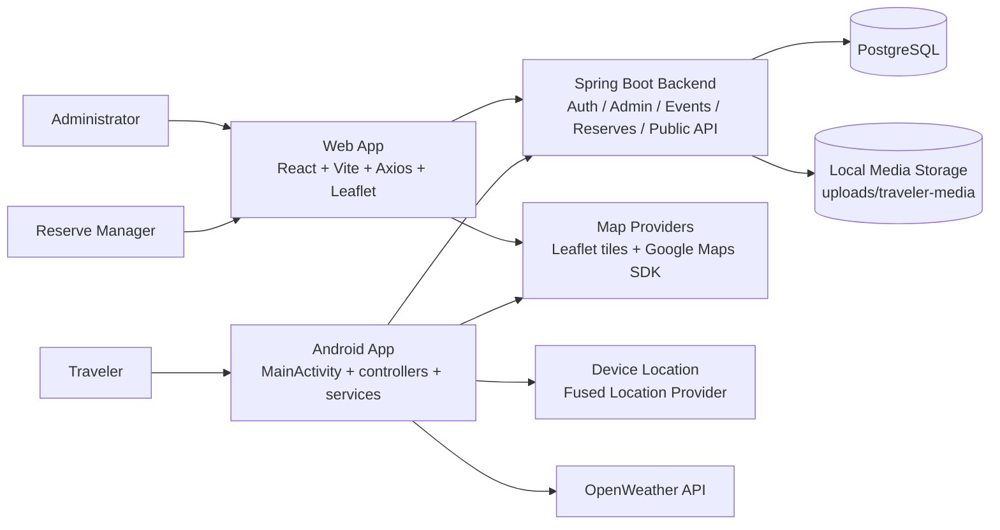

# System Architecture Planning Document

## Purpose

This document explains the high-level design of the full reserve management system and provides a high-level block diagram for planning, onboarding, and design discussions.

This is the system-level companion to the existing mobile-focused documents:

- [Mobile App Planning Document](./mobile-app-planning.md)
- [Android App Block Diagram](./android-app-block-diagram.md)
- [MainActivity Workflow](./main-activity-workflow.md)
- [System Architecture Block Diagram](./system_architecture_block_diagram.drawio)

## System Summary

The project is a full-stack reserve operations system with three main runtime applications:

- a Spring Boot backend that owns business logic, persistence, authentication, and public APIs
- a React web dashboard for administrators and reserve managers
- an Android traveler app for public reserve visibility and report submission

At a high level, the system separates responsibilities by user type:

- administrators manage the reserve catalog and manager assignments
- reserve managers manage operational events and publish traveler-facing updates
- travelers consume approved public updates and send field reports

## Design Goals

The current system design is optimized for:

- clear separation between staff workflows and traveler workflows
- one shared backend as the source of truth
- simple client applications with role-appropriate responsibilities
- practical local development with Docker, Spring Boot, Vite, and Android Studio

## High-Level Design

### 1. Backend as the system core

The backend is the center of the system.

It is responsible for:

- authentication and JWT-based identity
- authorization for admin and manager actions
- reserve catalog access
- event creation, updates, publication, and closure
- reserve request handling
- traveler report intake
- database persistence
- local storage for uploaded traveler media

This means the backend is both the policy layer and the data layer boundary for the system.

### 2. Web app as the staff operations client

The web app is the operational client for authenticated staff users.

It is responsible for:

- sign in and sign up for managers
- role-aware routing between admin and manager experiences
- admin reserve catalog review and assignment workflow
- manager event creation and event status updates
- publishing or hiding traveler-visible events
- map-based inspection of reserve inventory and events

The web app does not own business rules. It calls backend APIs and renders the results.

### 3. Mobile app as the traveler client

The mobile app is intentionally narrower than the web app.

It is responsible for:

- loading public reserves
- loading published traveler-facing hazards
- showing reserve areas and hazards on a map
- resolving whether the traveler is inside a reserve
- showing weather for the current location
- collecting traveler reports with optional media

The mobile app talks only to the public traveler backend endpoints and external mobile platform services such as maps, device location, camera/file access, and weather.

### 4. PostgreSQL and media storage as persistence

The system persists structured application data in PostgreSQL and stores uploaded traveler media on local disk during development.

This gives the architecture two storage concerns:

- relational data for reserves, users, events, requests, and logs
- file storage for traveler attachments

## System Layers

The current high-level layers are:

- clients:
  - web dashboard
  - Android traveler app
- backend application:
  - controllers and API surface
  - services and domain logic
  - security and authorization
  - mapping and validation
- persistence:
  - PostgreSQL
  - local traveler-media uploads
- external services:
  - Google Maps SDK
  - Fused Location Provider
  - OpenStreetMap tiles through Leaflet
  - OpenWeather

## High-Level Block Diagram

## Runtime Responsibilities By Component

### Web app

Main responsibility:
Provide the authenticated staff experience.

Main concerns:

- auth token handling
- admin screens
- manager screens
- map-based inspection
- event and request forms

Primary backend areas used:

- `/api/auth`
- `/api/admin`
- `/api/reserves`
- `/api/events`
- `/api/reserve-requests`

### Mobile app

Main responsibility:
Provide the traveler experience.

Main concerns:

- reserve and hazard visibility
- map rendering
- device location
- report submission with attachments
- weather overlay

Primary backend areas used:

- `/api/public/reserves`
- `/api/public/events`
- `/api/public/reports`

### Backend

Main responsibility:
Coordinate all application rules and shared data.

Main concerns:

- role-based access control
- reserve and event domain logic
- manager assignment workflow
- traveler report intake
- public/mobile-safe event exposure
- persistence and migrations

### Database and storage

Main responsibility:
Persist operational state and uploaded assets.

Main concerns:

- relational consistency
- migration-based schema evolution
- separation between structured records and file uploads

## Primary Data Flows

### 1. Staff authentication and dashboard flow

1. Admin or manager signs in through the web app.
2. Web app calls backend auth endpoints.
3. Backend validates credentials and returns a JWT.
4. Web app uses that token for subsequent admin or manager API calls.
5. Backend filters and returns role-appropriate data.

### 2. Manager event operations flow

1. Manager opens assigned reserve data in the web app.
2. Web app loads reserves, events, and reserve requests from the backend.
3. Manager creates or updates an event.
4. Backend validates the request and persists the change.
5. If the event is published, it becomes visible to traveler-facing public APIs.

### 3. Traveler hazard visibility flow

1. Android app loads public reserves from the backend.
2. Android app loads published events for each reserve.
3. Mobile app maps the JSON into local models.
4. `MapController` renders reserve areas and public hazards on the map.

### 4. Traveler report submission flow

1. Traveler fills the report form in the Android app.
2. Mobile app resolves a location and optional media attachments.
3. Mobile app uploads the report through the public backend endpoint.
4. Backend creates a traveler-origin event and stores any media.
5. Managers later review that event in the web app.

### 5. Admin assignment flow

1. Admin opens the reserve catalog in the web app.
2. Web app loads managers, reserve requests, and reserve summaries.
3. Admin assigns or unassigns a manager for a reserve.
4. Backend persists the assignment state.
5. Updated assignment affects manager-visible reserve data and event access.

## Current Architectural Strengths

- The system has a clear separation between staff operations and public traveler access.
- The backend is a clean single source of truth for shared state.
- The mobile app is intentionally scoped to traveler use cases, which limits exposure of privileged actions.
- The web app maps well to the business roles in the system.
- The repository structure is easy to explain because it matches the runtime components.

## Current Architectural Constraints

### 1. The backend is the main coupling point

This is mostly a good thing, but it also means:

- API shape changes affect both clients
- domain logic changes must be coordinated carefully
- the backend becomes the main scaling point for future features

### 2. The web and mobile apps intentionally have unequal scope

The difference is by design today, but it creates product planning questions:

- should mobile stay traveler-only
- should any manager features move to mobile later
- how much parity between platforms is actually desired

### 3. The mobile app uses direct HTTP and manual JSON parsing

This keeps the code lightweight, but it also means:

- transport concerns and parsing are tightly coupled
- payload changes require careful manual updates
- testing seams are thinner than in a repository-style client layer

### 4. Local file storage is practical but limited

Using local media storage is fine for development, but it is not the final shape for larger deployment or multi-instance hosting.

## Planning Direction

### Phase 1: keep the architecture explicit

Recommended work:

- treat this document as the project-level architecture reference
- keep mobile-specific and system-level docs separate
- maintain a clear contract table for backend endpoints used by each client

### Phase 2: strengthen API boundaries

Recommended work:

- document authenticated versus public endpoints more explicitly
- introduce versioning or stronger DTO discipline if payloads grow
- keep traveler-safe and staff-only response models intentionally separate

### Phase 3: reduce client-side drift

Recommended work:

- keep the web app as the staff platform unless mobile staff workflows become a real requirement
- avoid copying manager/admin features into mobile without a product reason
- align naming and domain models across backend, web, and mobile where practical

### Phase 4: prepare for production-style deployment

Recommended work:

- plan for production media storage beyond local disk
- formalize environment configuration for each application
- add stronger operational monitoring around API failures and upload flows

## Suggested Near-Term Documentation Targets

The most useful next docs after this one would be:

1. an endpoint responsibility matrix showing which client uses which backend routes
2. a role and permission matrix for admin, manager, and traveler capabilities
3. a deployment diagram for local development versus future hosted deployment
4. a data model overview for reserves, events, requests, users, and media

## Summary

The system is built around one strong backend core and two intentionally different clients:

- the web app for authenticated reserve operations
- the Android app for public traveler workflows

That separation is the main architectural idea to preserve. The next planning steps should focus on keeping API boundaries explicit, documenting cross-client contracts, and preparing the backend and storage model for future growth without collapsing the current clean role split.
