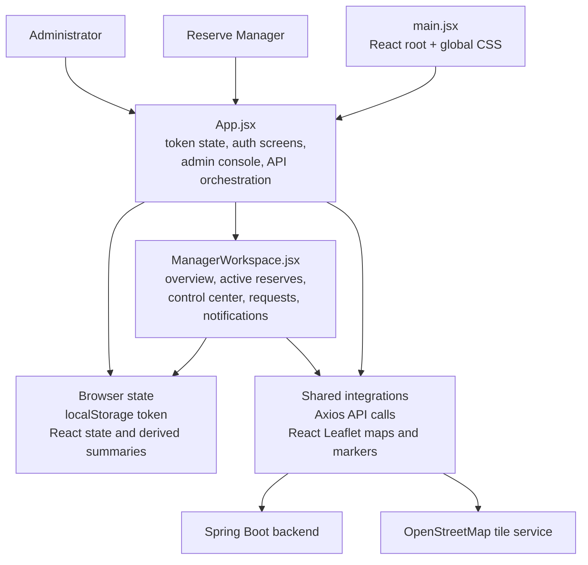

# Web App Block Diagram

This document explains the current React dashboard structure in the `web-app` module.

Draw.io source:

- [web_app_block_diagram.drawio](./web_app_block_diagram.drawio)

Related docs:

- [Web App README](../web-app/README.md)
- [Backend Block Diagram](./backend-block-diagram.md)
- [System Architecture Planning Document](./system-architecture-planning.md)

## Web App Block Diagram

## How To Read The Diagram

- `main.jsx` is only the bootstrap layer. It mounts `App.jsx`, imports Leaflet CSS, and loads the shared stylesheet.
- `App.jsx` is the top-level coordinator. It owns token storage, login and signup forms, admin dashboard data loading, and the role switch into the manager workspace.
- `ManagerWorkspace.jsx` contains the manager-specific experience: reserve overview, reserve control center, request history, notifications, event updates, and POI tools.
- Browser state is a mix of `localStorage` and large React state trees rather than a dedicated global store.
- Axios and React Leaflet act as the two main integration boundaries.

## Main UI Flows

### Authentication And Role Selection

1. `App.jsx` reads the JWT from `localStorage`.
2. It calls `/api/auth/me` to resolve the current profile.
3. Admins stay in the admin console inside `App.jsx`.
4. Managers are routed into `ManagerWorkspace.jsx`.

### Admin Console Flow

- Admin filters, assignment forms, reserve detail loading, and the admin map all stay inside `App.jsx`.
- The admin area calls `/api/admin/*` and `/api/auth/me`.

### Manager Operations Flow

- `ManagerWorkspace.jsx` receives reserves, events, POIs, POI types, and request data as props.
- The control center combines forms, filters, notifications, and a Leaflet map for event and POI work.
- Manager actions call `/api/reserves/*`, `/api/events/*`, and `/api/reserve-requests/*`.

## Notes

- The app does not use a dedicated client-side router today. Screen changes are mostly state-driven.
- There is no separate frontend API service module yet. Axios calls are made directly inside the main components.
- Both the admin and manager experiences share the same backend base URL and the same browser token storage pattern.
